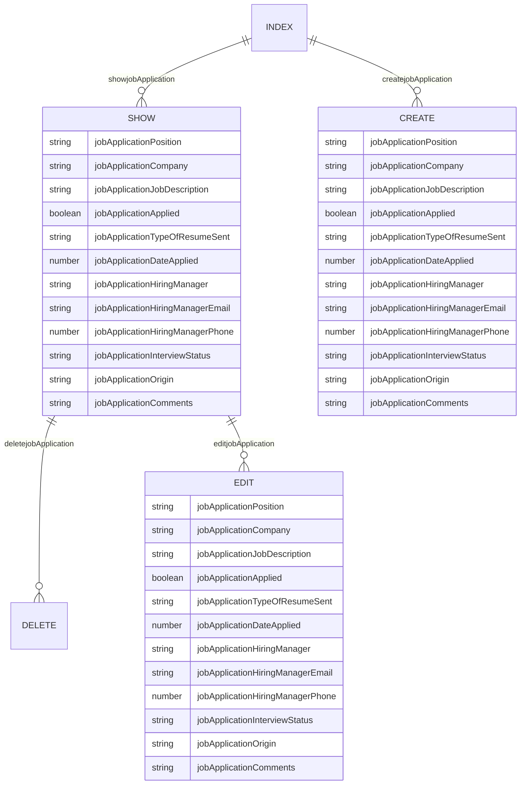

# Project 4 Backend

- **Project Name:** Job Application Tracker
- **Project By:** Adrian Garcia
- [**Link To  Frontend GITHUB**](https://github.com/adriancgarcia/project4_jobapptrackerfrontend)
- [**LINK TO DEPLOYED WEBSITE**]()
- **List of technologies used** Python, Django, Neon, Javascript
- [**Link to Trello**](https://trello.com/b/4KPQUvN2/job-application-tracker)

## Description

When applying to jobs we submit multiple applications, sometimes in the hundreds. Keeping track of all the companies and positions you've applied to can get confusing and overwhelming. My job application tracker can help keep you organized by keeping a log of all the necessary information for each job you've applied to. This will help you when you get the call from a company to do your first interview. 

## List of Backend Endpoints

|     ENDPOINT      | Method |          Purpose          |
| ----------------- | ------ | ------------------------- |
| /jobApplications           | GET    | Display list of jobApplications    |
| /jobApplications/new       | POST    | Create a new jobApplication         |
| /jobApplications/:id       | DELETE | Delete an existing jobApplication  |
| /jobApplications/:id       | PUT    | Update an existing jobApplication  |
| /jobApplications/:id       | GET    | Display on jobApplication          |

## ERD (ENTITY RELATIONSHIP DIAGRAM)

